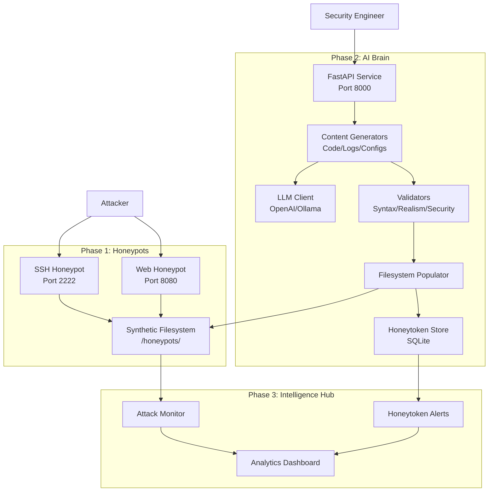

# Honeypot AI - System Architecture

## Overview

Honeypot AI is a multi-phase deception platform that uses Generative AI to create realistic synthetic environments for detecting and analyzing cyber attacks.

## System Architecture Diagram



## Component Descriptions

### Phase 2: AI Brain (Content Generator)

#### 1. **LLM Client** (`core/llm_client.py`)
- Abstraction layer for multiple LLM providers
- Supports OpenAI API, Azure OpenAI, and local Ollama
- Async operations for high throughput
- Retry logic with exponential backoff
- Token counting and rate limiting

#### 2. **Content Generators** (`generators/`)
Specialized generators for different content types:

**Source Code Generator** (`source_code.py`)
- Python: Flask/Django apps, scripts, automation
- JavaScript: Node.js servers, API clients
- Shell: Backup scripts, deployment scripts
- Go: Simple servers, CLI tools

**Config File Generator** (`config_files.py`)
- Shell configs: .bashrc, .bash_profile
- SSH configs: .ssh/config
- Environment files: .env
- Web server configs: nginx.conf
- Container configs: docker-compose.yml

**System Log Generator** (`system_logs.py`)
- Authentication logs: /var/log/auth.log
- System logs: /var/log/syslog
- Command history: .bash_history
- Web server logs: Apache/Nginx access logs

**Honeytoken Generator** (`honeytokens.py`)
- AWS access keys (AKIA...)
- SSH private keys (RSA/ED25519)
- Database passwords
- API tokens (JWT-like)
- GitHub tokens (ghp_...)
- Stripe keys (sk_live_...)

**User Documents Generator** (`user_documents.py`)
- Notes, TODOs, meeting logs
- README files
- Personal documents

#### 3. **Validators** (`validators/`)

**Syntax Validator** (`syntax.py`)
- Python: ast.parse()
- JavaScript: Basic syntax checks
- Shell: shellcheck
- YAML/JSON: Parser validation

**Realism Validator** (`realism.py`)
- Entropy analysis
- Pattern matching (avoid "foo", "bar")
- Consistency checks
- Returns realism score (0.0 - 1.0)

**Security Validator** (`security.py`)
- Ensures no real secrets leaked
- Pattern matching for known credential formats
- Validates all generated content is synthetic

#### 4. **Filesystem Populator** (`populator/`)

**Base Populator** (`filesystem.py`)
- Deploys content to honeypot filesystems
- Sets correct file permissions (644, 755, 600)
- Applies realistic timestamps (random past dates)
- Simulates file ownership

**Population Strategies** (`strategies.py`)
Predefined profiles:
- `developer_workstation`: Code, git repos, IDE configs
- `production_server`: Logs, configs, deployment scripts
- `database_server`: DB dumps, backup scripts, credentials

**Consistency Manager** (`consistency.py`)
- Ensures cross-file references are valid
- Maintains realistic project structure
- Links honeytokens across multiple files

#### 5. **Storage** (`storage/`)

**Honeytoken Store** (`honeytoken_store.py`)
- SQLite database for tracking all honeytokens
- Records: token type, value, location, creation time
- Query interface for monitoring

**Generation Log** (`generation_log.py`)
- Logs all content generation operations
- Audit trail for debugging
- Performance metrics

#### 6. **FastAPI Application** (`api/`)

**Endpoints**:
```
POST /api/v1/generate/source-code
POST /api/v1/generate/config
POST /api/v1/generate/logs
POST /api/v1/generate/document
POST /api/v1/generate/honeytoken

POST /api/v1/populate/{honeypot_id}
POST /api/v1/populate/{honeypot_id}/profile/{profile_name}
GET  /api/v1/populate/{honeypot_id}/status

GET  /api/v1/honeytokens
GET  /api/v1/honeytokens/{token_id}
POST /api/v1/honeytokens/check

GET  /api/v1/health
GET  /api/v1/metrics
```

**Features**:
- Request/response validation with Pydantic
- API key authentication
- Rate limiting
- Structured logging
- OpenAPI documentation (Swagger UI at `/docs`)

### Phase 1: Honeypots (Planned)

#### SSH Honeypot
- Simulated SSH server on port 2222
- Realistic command responses
- Filesystem backed by AI-generated content
- Logs all attacker interactions

#### Web Honeypot
- Vulnerable web application on port 8080
- Realistic application structure
- AI-generated source code and configs
- Captures exploitation attempts

### Phase 3: Intelligence Hub (Planned)

#### Attack Monitor
- Real-time monitoring of honeypot interactions
- Pattern recognition for attack techniques
- Integration with threat intelligence feeds

#### Honeytoken Alert System
- Monitors for honeytoken usage outside honeypot
- Alerts when fake credentials are used
- Tracks attacker infrastructure

#### Analytics Dashboard
- Visualization of attack patterns
- Honeytoken usage statistics
- Attacker behavior analysis
- Export to SIEM systems

## Data Flow

### Content Generation Flow
```
1. API Request → FastAPI endpoint
2. Request validation → Pydantic schemas
3. Generator selection → Based on content type
4. Template selection → Jinja2 templates
5. LLM prompt construction → Context + few-shot examples
6. LLM generation → OpenAI/Ollama API call
7. Validation → Syntax, realism, security checks
8. Storage → File written to filesystem
9. Honeytoken tracking → Recorded in database
10. Response → Return metadata to client
```

### Population Flow
```
1. Profile selection → developer/server/database
2. File list generation → Based on profile
3. For each file:
   a. Content generation → Call appropriate generator
   b. Validation → Ensure quality
   c. Consistency checks → Cross-reference with other files
   d. Deployment → Write with permissions/timestamps
4. Honeytoken distribution → Embed across multiple files
5. Final validation → Verify realistic environment
```

## Technology Stack

### Backend
- **Python 3.11+** - Modern Python with type hints
- **FastAPI** - Async web framework
- **Pydantic** - Data validation
- **SQLAlchemy** - ORM for database
- **Jinja2** - Template engine

### LLM Integration
- **OpenAI API** - GPT-4, GPT-3.5-turbo
- **Ollama** - Local LLM support
- **LangChain** (optional) - LLM orchestration

### Testing
- **pytest** - Testing framework
- **pytest-asyncio** - Async test support
- **pytest-cov** - Coverage reporting
- **httpx** - Async HTTP client for API tests

### Deployment
- **Docker** - Containerization
- **Docker Compose** - Multi-service orchestration
- **Uvicorn** - ASGI server

## Security Considerations

1. **No Real Secrets**: All generated credentials are fake and tracked
2. **Isolation**: Honeypots run in isolated containers
3. **Monitoring**: All attacker actions are logged
4. **Validation**: Multiple layers of security checks
5. **Rate Limiting**: Prevents abuse of generation APIs

## Scalability

- **Async Operations**: Non-blocking I/O for high throughput
- **LLM Caching**: Reduce redundant API calls
- **Horizontal Scaling**: Multiple AI Brain instances
- **Database**: SQLite for development, PostgreSQL for production

## Performance

- **Generation Time**: ~2-5 seconds per file (depends on LLM)
- **Validation Time**: <100ms per file
- **Population Time**: ~30-60 seconds for complete profile
- **API Response Time**: <3 seconds for typical requests

## Future Enhancements

1. **Multi-language Support**: Add support for more programming languages
2. **Custom Templates**: User-defined Jinja2 templates
3. **Machine Learning**: Realism scoring with ML models
4. **Distributed Generation**: Queue-based async generation
5. **Advanced Consistency**: Graph-based dependency tracking
